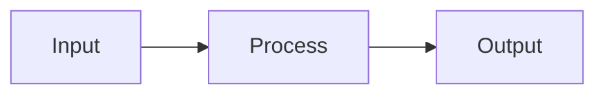

# Design: [exercise or feature name]

**Status:** draft | approved  
**Date:** YYYY-MM-DD  
**Plan:** [link to plan.md](./plan.md)

## Approach summary

[Short description of the chosen solution.]

## Components and files

| Piece | Path / role |
| --- | --- |
| … | … |

## Data flow

## Key decisions

| Decision | Choice | Alternatives considered | Rationale |
| --- | --- | --- | --- |
| … | … | … | … |

## Acceptance criteria → checks

| Criterion | How we will verify |
| --- | --- |
| … | … |

## Implementation tasks (ordered)

1. …

## Approval

- [ ] Design **approved** — OK to implement

**Approved by:** …  
**Date:** …
