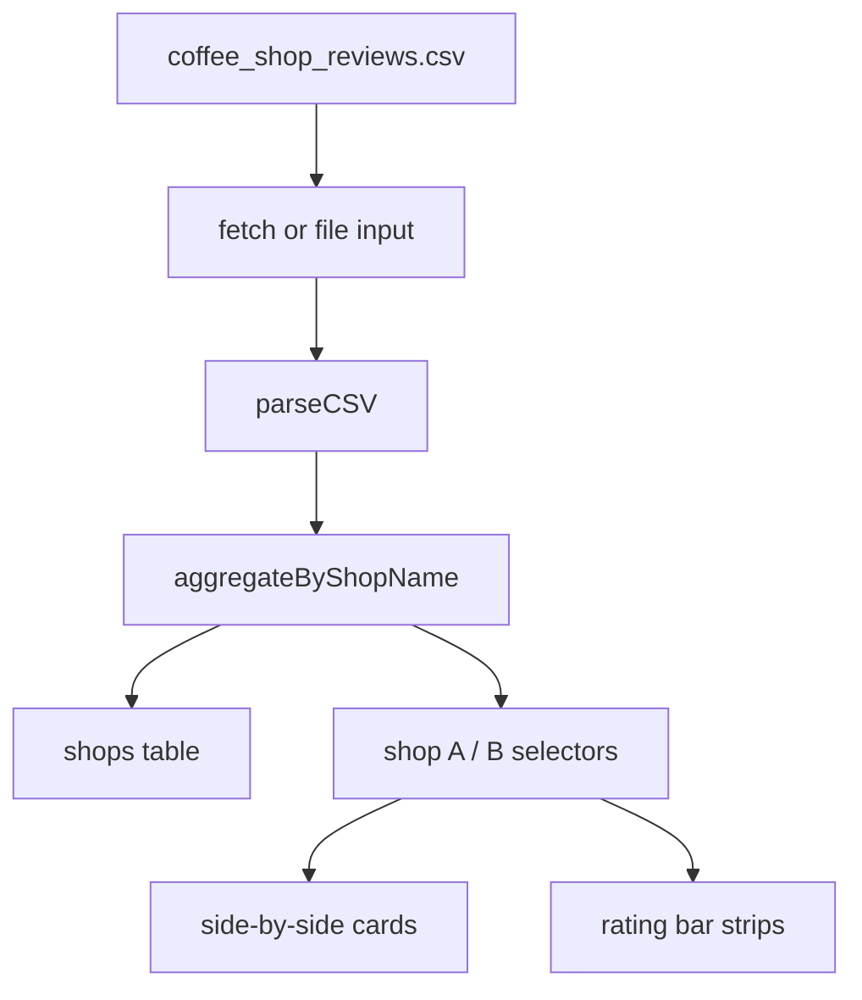

# Design: Coffee shop comparison tool

**Status:** approved  
**Date:** 2026-07-19  
**Plan:** [plan.md](./plan.md)

## Approach summary

Single-page app (`index.html`) with embedded CSS and JavaScript. Load CSV via `fetch` when served from the exercise directory; optional file input if fetch fails. Parse CSV in the browser, **aggregate reviews by `shop_name`**, render a table of all shops, and a **compare** section with two dropdowns, side-by-side metric cards, and horizontal bar strips for rating dimensions.

## Components and files

| Piece | Path / role (from `day-1/`) |
| --- | --- |
| UI + logic | `coffee-shop-comparison/index.html` |
| Data | `coffee-shop-comparison/coffee_shop_reviews.csv` |
| Local server | `coffee-shop-comparison/serve.sh` (`python3 -m http.server`) |
| Plan / design / verify | `docs/coffee-shop-comparison/*.md` |

## Data flow

## Key decisions

| Decision | Choice | Alternatives considered | Rationale |
| --- | --- | --- | --- |
| Stack | Single HTML file | Python + Flask, React | Lab Option 2; no npm; fast |
| Load CSV | `fetch` + local server | Embed CSV in HTML | Keeps data separate; file picker fallback |
| Shop metrics | Mean of numeric columns per shop | Show every review row | Matches “compare shops” intent |
| Compare UX | Two selects + cards + bars | Table diff only | Meets Silver “meaningful comparison” |
| Amenities | % of reviews with WiFi / mobile true | Single latest row | Simple signal from boolean fields |

## Data model / interfaces

**Input row (CSV):** `shop_name`, `address`, `neighborhood`, numeric rating/price/wait fields, booleans `has_wifi`, `mobile_ordering` (`"True"`/`"False"`).

**Aggregated shop:** identity fields, averaged metrics, `review_count`, `wifi_pct`, `mobile_pct`.

**UI states:** loading, error (with file fallback), loaded (table + compare visible).

## Acceptance criteria → checks

| Criterion | How we will verify |
| --- | --- |
| CSV loads | Server returns 200; status shows review + shop counts |
| ≥5 shops | Table lists 12 unique shops |
| ≥5 metrics per shop | Table + compare cards |
| Comparison | Shop A/B updates cards and bars |
| No runtime errors | Load via `./serve.sh` |

## Implementation tasks (ordered)

1. Add `index.html` shell sections
2. CSV parser + aggregation by `shop_name`
3. All-shops table
4. Compare dropdowns, cards, bars
5. `fetch` + file fallback
6. `serve.sh` + verify doc

## Approval

- [x] Design **approved** — OK to implement

**Approved by:** participant  
**Date:** 2026-07-19
