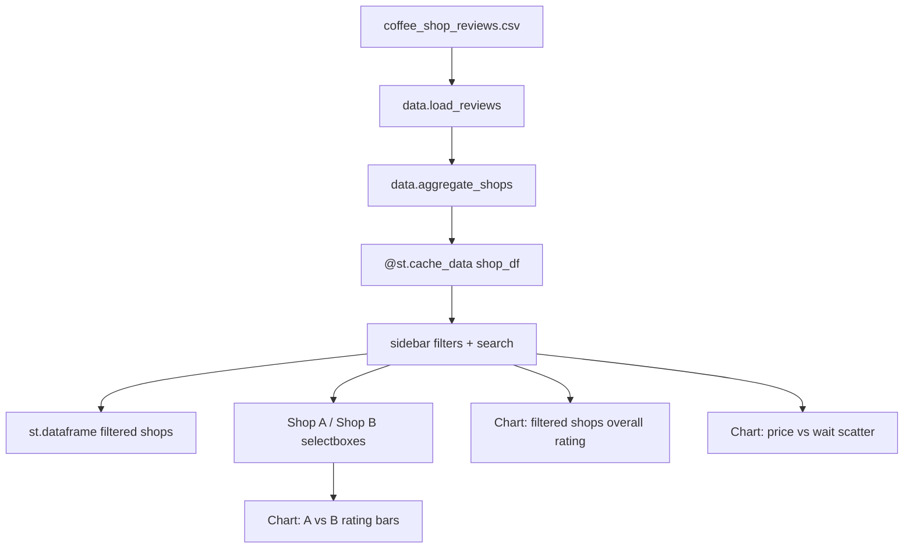

# Design: Coffee shop comparison tool (Gold, Python)

**Status:** approved  
**Date:** 2026-07-19  
**Plan:** [plan.md](./plan.md)

> **Gate:** Implement only after [plan.md](./plan.md) is **agreed** and this document is **approved**.

## Approach summary

Replace the primary lab entry point with a **Streamlit** application backed by **pandas**. On startup, load `coffee_shop_reviews.csv`, aggregate to one row per shop, and expose:

1. **Sidebar filters** (neighborhood, min rating, amenities) plus **search** on shop name  
2. **Main table** of filtered shops with sortable metrics  
3. **Compare** panel: Shop A and Shop B selectors tied to shared filtered list  
4. **Three visualizations** updating with filters and compare selection  

Keep aggregation rules aligned with the existing Silver HTML app so behavior stays consistent while UX reaches Gold.

## Components and files

| Piece | Path (under `training/day-1/coffee-shop-comparison/`) | Role |
| --- | --- | --- |
| Entry UI | `app.py` | Streamlit layout, widgets, charts, page config |
| Data layer | `data.py` | `load_reviews()`, `aggregate_shops(df)`, filter helpers |
| Dependencies | `requirements.txt` | `pandas`, `streamlit` (pinned versions) |
| Run helper | `run.sh` | Optional: activate venv + `streamlit run app.py` |
| Data | `coffee_shop_reviews.csv` | Source of truth (unchanged) |
| Legacy | — | Removed; Streamlit is the only app entry |
| Docs | `../docs/coffee-shop-comparison/*.md` | Plan, design, verify |

Suggested layout:

```text
coffee-shop-comparison/
├── app.py
├── data.py
├── requirements.txt
├── run.sh
├── coffee_shop_reviews.csv
├── README.md          # updated in Implement: Python quick start
└── run.sh
```

## Data flow



## Key decisions

| Decision | Choice | Alternatives considered | Rationale |
| --- | --- | --- | --- |
| Language | Python 3.10+ | Keep vanilla JS only | User preference; pandas fits aggregation |
| UI framework | Flask + Jinja + client JS (Chart.js) | Streamlit | Dynamic compare `<select>` options + Streamlit widget session state caused repeated UI crashes |
| CSV parsing | `pandas.read_csv` | Manual parser | Robust quoting; lab recommends pandas for Option 1 |
| Aggregation | Group by `shop_name`, mean numerics, count rows, amenity % | Raw review table | Matches compare-shops intent; 12 shops from 1061 rows |
| Data to browser | Embed aggregated JSON once at page load | Streamlit rerun per widget | Filters/compare/charts run client-side; no server session |
| Primary run | `python app.py` / `./run.sh` on :8501 | `streamlit run` | Simple local demo |
| Styling | Streamlit `set_page_config` + custom CSS block in `app.py` | External theme repo | “Clean UI” without a front-end build |

## Data model

**Raw columns used:** `shop_name`, `address`, `neighborhood`, `overall_rating`, `coffee_quality`, `service_quality`, `atmosphere`, `value_score`, `avg_price`, `wait_time_minutes`, `has_wifi`, `mobile_ordering`.

**Aggregated shop record (one row per shop):**

| Field | Type | Rule |
| --- | --- | --- |
| `shop_name`, `address`, `neighborhood` | str | `first` in group |
| `overall_rating`, `coffee_quality`, … `avg_price`, `wait_time_minutes` | float | `mean` |
| `review_count` | int | `count` |
| `wifi_pct`, `mobile_pct` | float 0–100 | % of rows where bool column is True |

**Boolean parsing:** map `has_wifi`, `mobile_ordering` from `"True"`/`"False"` strings (and actual bools if present) before aggregation.

**Filter inputs (sidebar):**

- `search`: optional string → `shop_name.str.contains(..., case=False, na=False)`
- `neighborhoods`: multiselect (default: all 12)
- `min_overall_rating`: slider 1.0–5.0 step 0.1
- `wifi_required`, `mobile_required`: checkboxes → `wifi_pct` / `mobile_pct` ≥ 50 (or 100 if stricter—use **≥ 50** for demo friendliness)

**Compare inputs:** two `selectbox` widgets populated from **filtered** shop names; default to first two alphabetically when ≥2 shops.

## UI structure (Gold)

```text
┌─────────────────────────────────────────────────────────────┐
│ Header: title + subtitle (loaded N reviews → M shops)       │
├──────────────┬──────────────────────────────────────────────┤
│ SIDEBAR      │ MAIN                                         │
│ Search       │ Section: All shops (filtered)                │
│ Neighborhood │   → st.dataframe (hide index)                │
│ Min rating   │ Section: Compare                             │
│ WiFi / Mobile│   → Shop A | Shop B                          │
│ [Reset]      │   → two metric columns (cards via st.metric) │
│              │ Section: Visualizations                      │
│              │   1. Grouped bar: A vs B on 5 rating dims  │
│              │   2. Bar: overall_rating by shop (filtered)  │
│              │   3. Scatter: avg_price vs wait_time_minutes │
└──────────────┴──────────────────────────────────────────────┘
```

**Empty state:** if filters yield zero shops, show `st.warning` and skip compare/charts (or disable selectors).

**Polish:** page title “Coffee Shop Comparison”, wide layout, consistent section headers, `st.metric` deltas optional (A minus B on overall rating in compare row).

## Visualizations (Gold minimum three)

| # | Chart | Data | Updates when |
| --- | --- | --- | --- |
| 1 | Grouped bar | Melted long form: Shop A vs Shop B × `{overall, coffee, service, atmosphere, value}` | A/B selection changes |
| 2 | Horizontal or vertical bar | Filtered shops × `overall_rating` | Filters/search change |
| 3 | Scatter | Filtered shops: `avg_price` (x) vs `wait_time_minutes` (y), label `shop_name` | Filters/search change |

Implementation note: build small DataFrames for each chart; avoid passing the full 1061-row review table to charts.

## Acceptance criteria → checks

| Criterion | How we will verify |
| --- | --- |
| CSV loads | App shows review count and 12 shops on fresh start |
| Bronze table | Filtered dataframe shows ≥5 shops with ≥5 metric columns |
| Silver compare | Shop A/B metrics and chart #1 differ when selections change |
| Gold search | Typing partial shop name narrows table |
| Gold filters | Neighborhood + min rating reduce row count predictably |
| Gold 3 charts | All three sections render without error for default filters |
| Gold UI | Wide layout, no traceback on filter-to-empty then reset |
| Local run | `pip install -r requirements.txt && streamlit run app.py` documented |

## Implementation tasks (ordered)

1. Add `requirements.txt` (pinned `pandas`, `streamlit`).
2. Implement `data.py`: load CSV path relative to file, aggregate, `apply_filters(df, ...)`.
3. Implement `app.py`: cached load, sidebar, filtered table, compare metrics.
4. Add three charts wired to filtered / compare selections.
5. Add empty states, reset filters, page config + light CSS.
6. Add `run.sh` (executable) mirroring documented command.
7. Update `coffee-shop-comparison/README.md` quick start for Python Gold path.
8. Remove unused Silver static app (`index.html`, `serve.sh`).
9. **Verify phase:** run manual + scripted checks; update [verify.md](./verify.md).

## Testing approach (Verify phase)

- Run app locally; snapshot filter behavior (e.g. neighborhood `Downtown` → includes Central Perk).
- Confirm aggregation: Central Perk `review_count` matches CSV groupby count.
- Compare two shops; confirm chart #1 series count = 2 × 5 metrics.
- No secrets in repo; `requirements.txt` only public packages.

## Approval

- [x] Design **approved** — OK to implement

**Approved by:** participant  
**Date:** 2026-07-19
